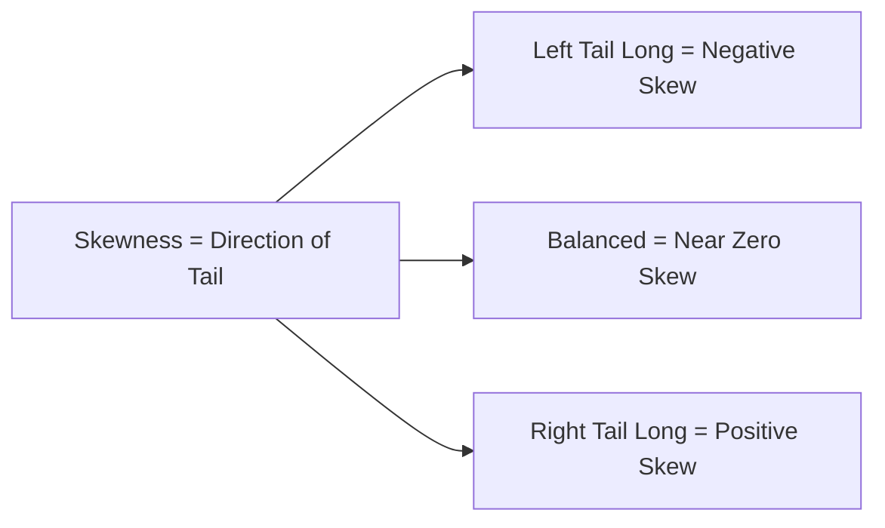
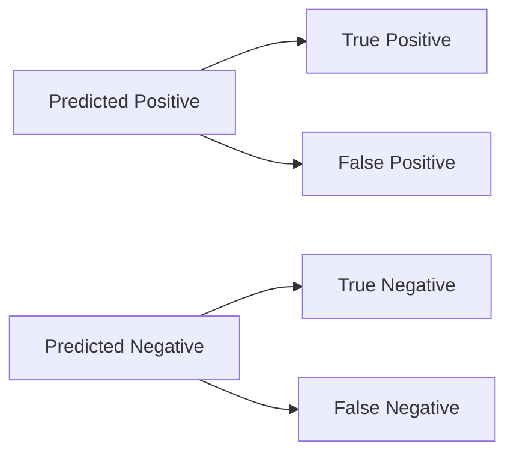
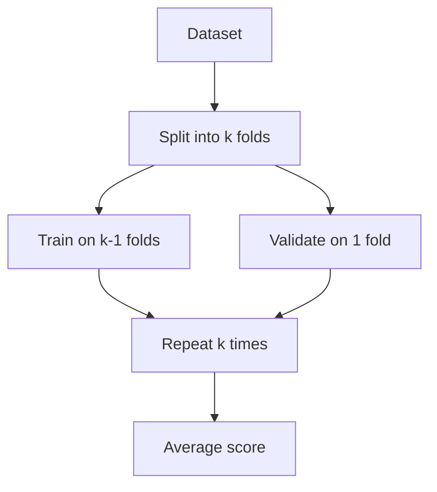
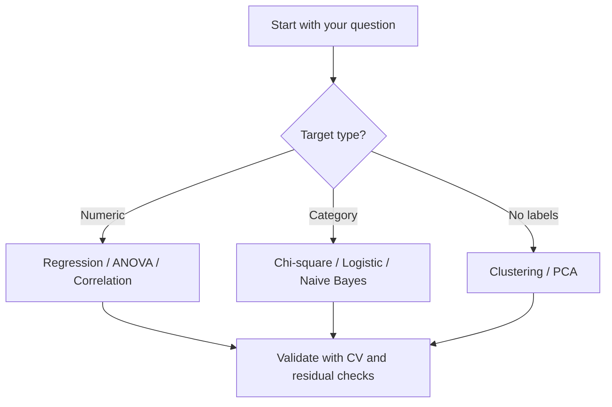

::: callout-important
This chapter turns statistics into intuition first, formulas second. The examples are deliberately real-world and a little playful, but the definitions stay mathematically correct.
:::

::: callout-tip
How to read this chapter:

1. Start with the story.
2. Learn the method name.
3. See the formula.
4. Connect it to ML/AI use.
:::

## Part 1: Foundations of Data Analysis

### 1. Descriptive vs. Inferential Statistics

Think of statistics as two different jobs.

Fun example first: imagine you run a cafe and record sales for 30 days.

- Descriptive statistics = your monthly report card.
- Inferential statistics = using those 30 days to predict next month.

- **Descriptive statistics** summarize what you already have. It is the profile grid of your data: counts, averages, percentages, and spread.
- **Inferential statistics** use a sample to make a claim about a larger population. It is the part where you see a few posts and try to guess the whole story.

| Concept | What it does | Real-life example |
|---|---|---|
| Descriptive | Summarizes observed data | Average likes on your last 20 posts |
| Inferential | Generalizes from sample to population | Predicting how all users might behave from a test group |

### 2. Measures of Central Tendency

Central tendency tells you where the center of the data lives.

Fun example first: five delivery times are 12, 13, 13, 14, and 45 minutes (one rider got stuck in traffic).

- **Mean**: the arithmetic average. It is the ultimate compromise, but it is sensitive to extreme outliers.
- **Median**: the middle value after sorting. It is much more stable when one value is wildly unusual.
- **Mode**: the most frequent value. It is the crowd favorite.

Example: if five friends pick restaurant budgets of $20, $25, $25, $30, and $5000, the mean is dragged upward by the billionaire, while the median stays near the center.

Formula:

$$\bar{x} = \frac{1}{n}\sum_{i=1}^{n} x_i$$

ML/AI use: median is often safer than mean when preprocessing skewed features.

### 3. Measures of Dispersion

Dispersion tells you how spread out the data is.

Fun example first: two classes can both have average score 70, but one class is tightly clustered near 70 and the other ranges from 20 to 100.

- **Range**: the distance between the largest and smallest values.
- **Mean deviation**: average distance from the center.
- **Variance** and **standard deviation**: the core measures of spread.
- **Quartile deviation**: focuses on the middle 50% and is less affected by outliers.

For sample data, variance is usually written as:

$$s^2 = \frac{\sum (x_i - \bar{x})^2}{n - 1}$$

and standard deviation is:

$$s = \sqrt{s^2}$$

Low spread means consistency. High spread means chaos, or at least a very eventful day.

ML/AI use: standardization scales features using standard deviation.

### 4. Skewness and Kurtosis

Shape matters as much as center and spread.

Fun example first:

- App session length is usually right-skewed (many short visits, few very long users).
- Daily stock returns often have heavy tails (big surprises happen more than normal models expect).

- **Zero skewness**: symmetric data, like a well-balanced mountain.
- **Positive skewness**: long tail to the right. Income data is the classic example because a small number of very large values stretch the tail.
- **Negative skewness**: long tail to the left. Early retirement ages can create this shape.
- **Leptokurtic**: sharp peak and heavy tails. Crypto returns are a memorable example.
- **Platykurtic**: flatter shape with lighter tails. Daily temperatures in a mild climate often feel this way.

Formulas:

$$\text{Skewness} = g_1 = \frac{\frac{1}{n}\sum_{i=1}^{n}(x_i-\bar{x})^3}{\left(\frac{1}{n}\sum_{i=1}^{n}(x_i-\bar{x})^2\right)^{3/2}}$$

$$\text{Excess Kurtosis} = g_2 = \frac{\frac{1}{n}\sum_{i=1}^{n}(x_i-\bar{x})^4}{\left(\frac{1}{n}\sum_{i=1}^{n}(x_i-\bar{x})^2\right)^2} - 3$$

ML/AI use: skewed features often benefit from log or power transforms.

## Part 2: Probability, Sampling, and Testing

### 5. Probability

Probability quantifies uncertainty.

Fun example first: before seeing the weather app, you estimate rain chance from the sky. After seeing dark clouds plus forecast, you update your belief.

- **Classical probability** assumes equally likely outcomes. A fair coin has a $1/2$ chance of landing heads.
- **Conditional probability** updates the odds after new information arrives.

If the sky is cloudy, the chance of carrying an umbrella changes. The data is the same object, but the context is different, so the probability changes too.

Core formulas:

$$P(A \mid B) = \frac{P(A \cap B)}{P(B)}$$

$$P(A \cup B) = P(A) + P(B) - P(A \cap B)$$

ML/AI use: conditional probability powers Naive Bayes classifiers.

### 6. Distribution and Sampling

In the real world, you usually cannot inspect every member of the population, so you sample.

Fun example first: tasting one spoon of soup is sampling; tasting every spoon is impossible.

- **Population**: the full group you care about.
- **Sample**: a smaller group you actually observe.
- **Distribution**: how values are spread across the scale.

The **Central Limit Theorem** says that the distribution of sample means tends toward normality as sample size grows, even if the original data is messy.

$$\bar{X} \approx N\left(\mu, \frac{\sigma}{\sqrt{n}}\right)$$

That is why repeated spoonfuls of soup can reveal the flavor of the entire pot.

ML/AI use: many confidence intervals and test statistics rely on this idea.

### 7. Parametric vs. Non-Parametric Tests

Use the test that matches your data, not the one that looks smartest in a slide deck.

Fun example first: if shoe sizes look reasonably bell-shaped, use parametric tests; if ratings are weird and heavily skewed, rank-based tests are safer.

- **Parametric tests** assume structure: often normality, equal variance, and other mathematical conditions. Examples include the t-test and ANOVA.
- **Non-parametric tests** are more flexible and often rely on ranks rather than raw values. Examples include Mann-Whitney and Kruskal-Wallis.

When the data is tidy, parametric tests are powerful. When the data is messy, non-parametric tests are often safer.

### 8. Hypothesis Testing

Hypothesis testing asks whether an observed effect is likely real or just noise.

Fun example first: did your new landing page actually increase signups, or did you get lucky this week?

- **Null hypothesis ($H_0$)**: no effect, no change, no difference.
- **Alternative hypothesis ($H_1$)**: there is an effect.
- **p-value**: how surprising the observed result would be if $H_0$ were true.

Important reviewer note: a p-value is not the probability that the null hypothesis is true. It is a probability under the assumption that the null is true.

If the p-value is small enough for your chosen threshold, you reject the null and move forward with the stronger claim.

Common test statistic:

$$z = \frac{\bar{x} - \mu_0}{\sigma/\sqrt{n}}$$

ML/AI use: A/B tests in product analytics are hypothesis tests.

### 9. Type I and Type II Errors

Even good tests can make mistakes.

Fun example first: spam filters.

- Marking a good email as spam is a Type I error.
- Missing a spam email is a Type II error.

- **Type I error**: false positive. You reject $H_0$ even though it is actually true.
- **Type II error**: false negative. You fail to reject $H_0$ even though it is false.

Smoke alarms are the perfect metaphor: one false alarm is annoying, but ignoring a real fire is much worse.

Power reminder:

$$\text{Power} = 1 - \beta$$

ML/AI use: threshold tuning is essentially balancing these errors.

### 10. ANOVA

If you want to compare more than two group means, ANOVA is the right tool.

Fun example first: three ad creatives, one budget, one KPI. ANOVA checks if at least one creative truly performs differently.

Instead of running many t-tests and inflating error risk, ANOVA compares:

- variation **between** groups
- variation **within** groups

The big question is simple: is at least one group genuinely different?

Example: if you test four diet plans at once, ANOVA tells you whether one of them stands out without turning the analysis into a pile of pairwise comparisons.

Formula:

$$F = \frac{\text{MS}_{\text{between}}}{\text{MS}_{\text{within}}}$$

ML/AI use: quick feature screening across multiple group labels.

### 11. Chi-Square Test

Chi-square is for categorical data.

Fun example first: are subscription tiers independent of preferred device type (mobile, desktop, tablet)?

- **Chi-square test of independence** checks whether two categorical variables are related.
- **Chi-square goodness-of-fit** checks whether observed category counts match an expected pattern.

Example: does relationship status depend on zodiac sign, or are the categories unrelated? Chi-square answers that with counts, not averages.

Formula:

$$\chi^2 = \sum \frac{(O - E)^2}{E}$$

ML/AI use: feature-label association checks for categorical variables.

## Part 3: Correlation, Regression, and Modeling

### 12. Correlation and Regression

Fun example first: ice cream sales and temperature rise together, but temperature is the hidden driver.

- **Correlation** measures strength and direction of association, from $-1$ to $+1$.
- **Regression** builds an equation to predict one variable from another.

Positive correlation means two variables move together. Negative correlation means one rises while the other falls. Zero correlation means there is no linear relationship.

Reviewer note: correlation is not causation. Two variables can move together because of a hidden third factor, coincidence, or shared trend.

Key formulas:

$$r = \frac{\sum (x_i - \bar{x})(y_i - \bar{y})}{\sqrt{\sum (x_i-\bar{x})^2\sum (y_i-\bar{y})^2}}$$

$$\hat{y} = \beta_0 + \beta_1 x$$

ML/AI use: correlation heatmaps help detect redundant features.

### 13. Correlation Types for Real Data

Fun example first: leaderboard ranks are not evenly spaced numbers, so rank correlation is often better than Pearson.

- **Pearson**: linear relationship on numeric values.
- **Spearman**: monotonic relationship on ranks.
- **Kendall**: rank agreement strength, robust for small samples.

Quick rule:

- Use Pearson for roughly linear, continuous features.
- Use Spearman/Kendall when outliers or nonlinearity make raw values unreliable.

ML/AI use: Spearman is common in feature engineering sanity checks.

### 14. Regression Assumptions

Linear regression works best when its assumptions are respected.

1. **Linearity**: the relationship should be roughly straight.
2. **Independence of errors**: one residual should not predict the next.
3. **Homoscedasticity**: the error spread should stay roughly constant.
4. **Normality of residuals**: the errors should look approximately normal.

If the fit is a highway, the road should not turn into a rollercoaster with widening lanes and echoing bumps.

Residual idea:

$$e_i = y_i - \hat{y}_i$$

ML/AI use: residual diagnostics catch model misspecification early.

### 15. Data Transformation for Regression

Sometimes a transform makes the pattern visible.

Fun example first: if influencer follower counts range from 200 to 20 million, raw scale hides useful patterns.

- **Log transform**: compresses large values and reduces skew.
- **Square root transform**: useful for moderate right-skew.
- **Power transform**: stretches or compresses the scale to improve linearity.

Example: log-transforming income can make the difference between regular salaries and billionaire wealth easier to model.

Formula:

$$x' = \log(x + c)$$

### 16. Dummy Variables

Regression wants numbers, so categorical variables need encoding.

Fun example first: for color = {red, blue, green}, do not feed words directly to linear models.

- Use **1** for presence of a category.
- Use **0** for absence.
- Drop one reference category to avoid perfect multicollinearity.

If you have VIP, VVIP, and General membership, you only need two dummy variables. The omitted category becomes the baseline.

### 17. Variable Selection

Not every available feature deserves a seat in the model.

Fun example first: packing for travel with one small bag forces you to keep only useful items.

- **Forward selection** starts small and adds useful variables.
- **Backward elimination** starts large and removes weak variables.
- **Stepwise selection** adds and removes variables as it goes.

Think of it like packing for a trip: the goal is to bring the essentials, not the entire closet.

ML/AI use: combine statistical selection with cross-validation, not p-values alone.

### 18. Logistic Regression

When the outcome is binary, logistic regression is the right fit.

Fun example first: will a customer churn this month: yes or no?

It converts a linear score into a probability using the sigmoid curve:

$$p = \frac{1}{1 + e^{-z}}$$

Example: should a user buy or not buy, click or not click, stay or leave? Logistic regression gives a probability, then a threshold turns that probability into a class.

Log-odds form:

$$\log\left(\frac{p}{1-p}\right) = \beta_0 + \beta_1x_1 + \cdots + \beta_kx_k$$

## Part 4: Classification, Clustering, and Time Series

### 19. Discriminant Analysis

Discriminant analysis separates known classes using the features that best distinguish them.

The Sorting Hat metaphor works well here: you already know the possible houses, and the model helps decide where a new person belongs.

### 20. Cluster Analysis

Cluster analysis finds natural groupings when the data has no labels.

Fun example first: at a food festival, people naturally gather by cuisine preference.

Example: people at a music festival cluster into different crowds based on taste, dress, and behavior. The algorithm groups similar points together using distance or similarity.

K-means objective:

$$\min \sum_{j=1}^{k}\sum_{x_i \in C_j} ||x_i - \mu_j||^2$$

ML/AI use: customer segmentation, anomaly pre-grouping, and recommendation bootstrapping.

### 21. Time Series and Forecasting

Time series data has order, not just values.

Fun example first: coffee sales peak every Monday morning and dip on Sundays.

- **Trend**: long-term direction.
- **Seasonality**: repeating calendar pattern.
- **Cyclical**: longer waves without fixed timing.
- **Noise**: the random part.

Example: winter coats spike every December, but an unexpected supply shock or pandemic can create irregular movement on top of the usual pattern.

Simple additive model:

$$Y_t = T_t + S_t + C_t + E_t$$

### 22. Model Evaluation

Once you build a model, you need to score it properly.

Fun example first: a medical test that predicts "healthy" for everyone can still look good on raw accuracy if disease is rare.

- **Confusion matrix**: TP, TN, FP, FN.
- **Accuracy**: overall correctness.
- **Precision**: how many predicted positives were actually positive.
- **Recall**: how many actual positives were found.
- **F1-score**: balance between precision and recall.
- **ROC-AUC**: how well the model ranks positives above negatives across thresholds.

If a disease screening model predicts "healthy" for almost everyone, accuracy can look excellent while the model still fails the people who need help. That is why precision, recall, and AUC matter.

Formulas:

$$\text{Precision} = \frac{TP}{TP+FP}$$

$$\text{Recall} = \frac{TP}{TP+FN}$$

$$F_1 = 2\cdot\frac{\text{Precision}\cdot\text{Recall}}{\text{Precision}+\text{Recall}}$$

## Part 5: Fun Statistical Methods for ML and AI

### 23. Bayes Theorem and Naive Bayes

Fun example first: a movie recommender updates your "will like sci-fi" probability after seeing you watched three space movies this week.

Bayes theorem:

$$P(A\mid B)=\frac{P(B\mid A)P(A)}{P(B)}$$

Naive Bayes assumes features are conditionally independent given the class.

ML/AI use: text classification, spam detection, baseline classifiers.

### 24. Confidence Intervals

Fun example first: your app conversion is 8%, but the interval says true performance likely sits between 7.2% and 8.8%.

95% CI for a mean (large sample):

$$\bar{x} \pm z_{0.975}\frac{\sigma}{\sqrt{n}}$$

ML/AI use: report uncertainty, not just point estimates.

### 25. Bootstrapping

Fun example first: you repeatedly refill a sample bag from itself to see how stable your metric is.

Process:

1. Sample with replacement from data.
2. Compute metric each time.
3. Use the distribution of metrics for intervals.

ML/AI use: robust uncertainty when analytic formulas are hard.

### 26. Cross-Validation

Fun example first: instead of judging a singer from one performance, you judge across many stages.

In $k$-fold CV, split data into $k$ parts, train on $k-1$ parts, validate on the remaining part, repeat.

$$\text{CV Error} = \frac{1}{k}\sum_{i=1}^{k} \text{Error}_i$$

ML/AI use: better estimate of out-of-sample performance.

### 27. Bias-Variance Tradeoff

Fun example first: a model can be too simple (misses patterns) or too complex (memorizes noise).

- High bias: underfitting.
- High variance: overfitting.
- Goal: balanced generalization.

Decomposition idea:

$$\text{Expected Error} \approx \text{Bias}^2 + \text{Variance} + \text{Noise}$$

ML/AI use: controls model complexity and regularization strategy.

### 28. Regularization (L1 and L2)

Fun example first: adding luggage fees forces you to pack only what matters.

- **L1 (Lasso)** can shrink some coefficients to exactly zero.
- **L2 (Ridge)** shrinks coefficients smoothly.

Formulas:

$$\text{Lasso: } \min \sum (y_i-\hat{y}_i)^2 + \lambda\sum |\beta_j|$$

$$\text{Ridge: } \min \sum (y_i-\hat{y}_i)^2 + \lambda\sum \beta_j^2$$

ML/AI use: combats overfitting and improves stability.

### 29. Entropy and Information Gain

Fun example first: a good yes/no question in a guessing game cuts uncertainty fast.

Entropy:

$$H(S) = -\sum_i p_i\log_2 p_i$$

Information gain:

$$IG = H(\text{parent}) - \sum_v \frac{|S_v|}{|S|}H(S_v)$$

ML/AI use: decision trees choose splits with high information gain.

### 30. PCA (Principal Component Analysis)

Fun example first: if you photograph a 3D object from the best angle, you still keep most shape information in 2D.

PCA finds directions (principal components) with maximum variance.

Optimization view:

$$\max_{\|w\|=1} \; w^T\Sigma w$$

ML/AI use: dimensionality reduction, visualization, denoising.

### 31. Outlier Detection with Z-Score and IQR

Fun example first: if one user clicks 10,000 times in a minute, that point deserves investigation.

Z-score:

$$z = \frac{x-\mu}{\sigma}$$

IQR rule:

$$x < Q1 - 1.5\cdot IQR \quad \text{or} \quad x > Q3 + 1.5\cdot IQR$$

ML/AI use: anomaly detection and robust data cleaning.

### 32. Which Method Should I Use First?

::: callout-tip
Quick reviewer rule: always ask three questions before trusting a result.

1. Is the data type correct for the test?
2. Are the assumptions reasonable?
3. Does the metric match the real-world cost of mistakes?
:::

## Final Takeaway

Statistics is not just formulas. It is the discipline of asking better questions, measuring uncertainty honestly, and choosing the right tool for the data you actually have.

If you remember only one idea, remember this: describe first, infer carefully, and always check the assumptions before you trust the conclusion.

Bonus memory trick: if you are stuck, start with these four in order.

1. Plot the data.
2. Check spread and skew.
3. Pick a method that matches data type.
4. Validate with out-of-sample testing.
